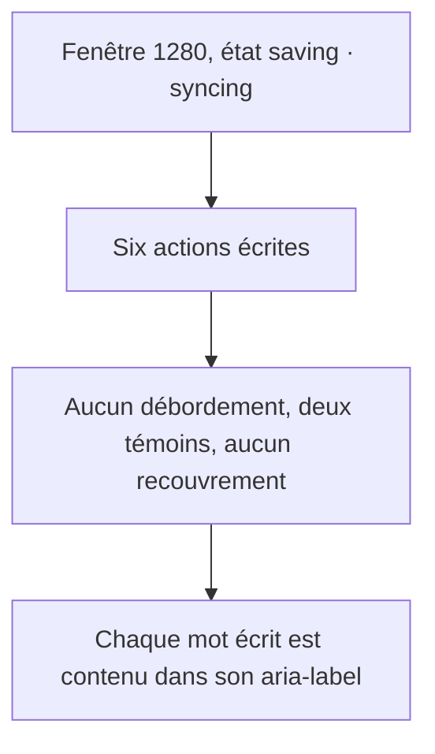
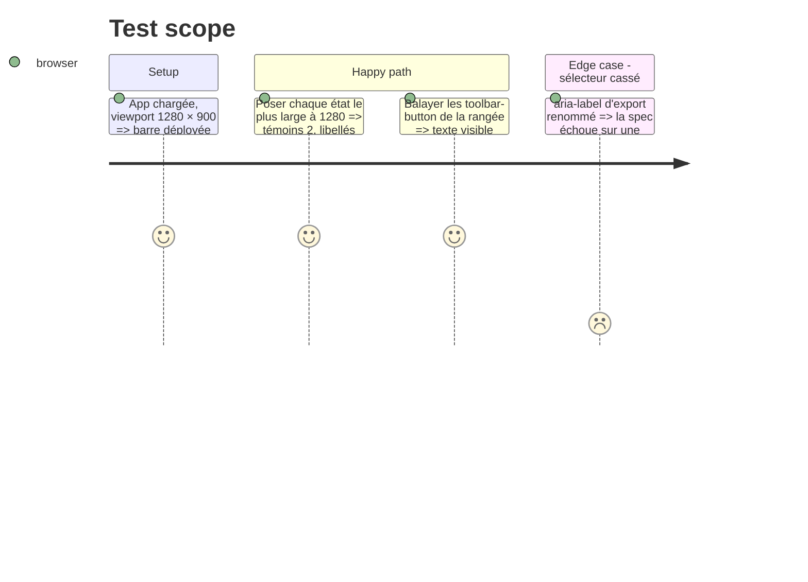

# Instruction: Barre du haut, spec responsive et mémoire projet

## Architecture projection

> Tree of the final files. ✅ create · ✏️ modify · ❌ delete

```txt
.
├── apps/web/src/components/toolbar/TopBar.tsx       ✏️ SecondaryAction sans className, usePlanAction sans classe morte ni commentaire faux
├── apps/web/src/lib/stage.ts                        ✏️ note du seuil de repli remesurée, « Versions figées » au lieu de « Releases »
├── apps/web/e2e/responsive-chrome.spec.ts           ✏️ erreur nommée, 1280 dans la boucle d'états, short ⊂ label balayé
├── CLAUDE.md                                        ✏️ ligne 234 : les trois slots du balayage
├── aidd_docs/memory/api.md                          ✏️ routes du pont : /proofread, GET /asc/apps|versions|localizations
├── aidd_docs/memory/design.md                       ✏️ cinquième seuil (mots), réglages dans « … », w-auto sm:w-auto
└── aidd_docs/memory/navigation.md                   ✏️ rangs composer / livrer, réglages dans « … »
```

## User Journey



## Test Scope



## Tasks to do

### `1)` Classe morte et commentaire faux (🟢 TopBar.tsx:991, :712, :542)

> Une action de rangée n'a qu'une façon de s'écrire.

1. Retirer `className` de `SecondaryAction` (:549), de `usePlanAction` (:716) et du `cn()` de `RowAction` (:991) ; retirer le commentaire « Le seul de la rangée qui porte un mot » (:712-715).
2. Le commentaire de `short` (:539) renvoie à l'assertion e2e de la tâche 2.

### `2)` La spec mesure ses états (🟡 responsive-chrome.spec.ts:88-108, 🟢 :97)

> Une largeur ne se mesure pas sans son état.

1. Dans l'`evaluate` interrogé (:97), `throw new Error('en-tête ou « Ouvrir l'export » absent')` à la place de `return null`.
2. Ajouter `TOP_BAR_ACTION_LABELS_WIDTH` à la boucle sur `ÉTATS_LES_PLUS_LARGES` avec `{ témoins: 2, libellésÉcrits: 0, débordement: 0, recouvrement: 0 }`.
3. À 1440, balayer `header [data-slot="toolbar-button"]` : pour chaque bouton portant un `span`, `aria-label` contient son texte.

### `3)` Commentaires et mémoire (🟢 stage.ts:226-234, :296, CLAUDE.md:234 ; 🟡 api.md:15 ; 🟢 design.md:22, navigation.md:23)

> Ce qui est écrit dit ce qui est mesuré.

1. `stage.ts` : sous `TOP_BAR_COMPACT_WIDTH`, une phrase « rangée remesurée à 487 sans les réglages ; 1024 garde une marge plus large, seuil inchangé » ; `DIALOG_SIDEBAR_WIDTH` : « Versions figées, Publier, Export ».
2. `CLAUDE.md:234` : « sweeps every `[data-slot="button"]`, `toolbar-button` and `menu-trigger` ».
3. `api.md` ligne Bridge : ajouter `/proofread` et `GET /asc/apps`, `/asc/versions`, `/asc/localizations` (lectures derrière `asc-publish`).
4. `design.md:22` : cinquième seuil vers le haut (les actions s'écrivent à `TOP_BAR_ACTION_LABELS_WIDTH`), réglages dans « … » à toute largeur, `w-auto sm:w-auto` comme `h-auto sm:h-auto`.
5. `navigation.md:23` : la barre porte identité, outils, deux rangs d'actions (composer, livrer) écrits au large, un menu « … » pour réglages et utilitaires, et l'export.

## Test acceptance criteria

| Task | Acceptance criteria |
| ---- | ------------------- |
| 1    | Aucune action ne porte de `className` ; le palier s'affiche dans le menu « … » comme avant ; `expectNoClippedControl` passe à 1440 et 1280 |
| 2    | À 1280, les trois états les plus larges tiennent sans débordement ni recouvrement ; chaque mot écrit sur la rangée est contenu dans son `aria-label` ; un sélecteur cassé échoue avec un message nommé |
| 3    | `api.md` nomme les dix routes du pont ; `design.md` et `navigation.md` décrivent la barre telle que `TopBar.tsx` la rend ; `stage.ts` ne nomme plus « Releases » |
