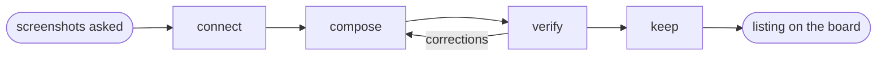

# ScreenForge MCP

## Actions

Run the flow above. Read only the next action file.

| Action  | Does                                         |
| ------- | -------------------------------------------- |
| connect | reach the open editor and read its project   |
| compose | pick a recipe and apply one batch per screen |
| verify  | render each screen and correct what it shows |
| keep    | save the layouts worth reusing as templates  |

## Transversal rules

- Write through `screenforge_apply`. One batch per screen is one validated transaction and one Ctrl+Z; the same calls sent loose are that many writes the user has to undo one by one.
- Never invent an identifier. Device models, shapes, icons and fonts are closed lists, and a value outside them is refused before it reaches the project.
- The project belongs to the user. Read it before writing, add rather than replace, and never delete a layer this run did not create.
- Every call can be refused, and the refusal names its cause and the expected sub-schema. Correct the call from what it says instead of retrying it unchanged.
- Read `target`, `canvas` and `globals.deviceModel` before composing. Coordinates are board units on that canvas: 440 by 956 for App Store, 540 by 960 for Google Play phone.
- Write the user's copy in the user's own language. The board is a real listing, not a demo.
